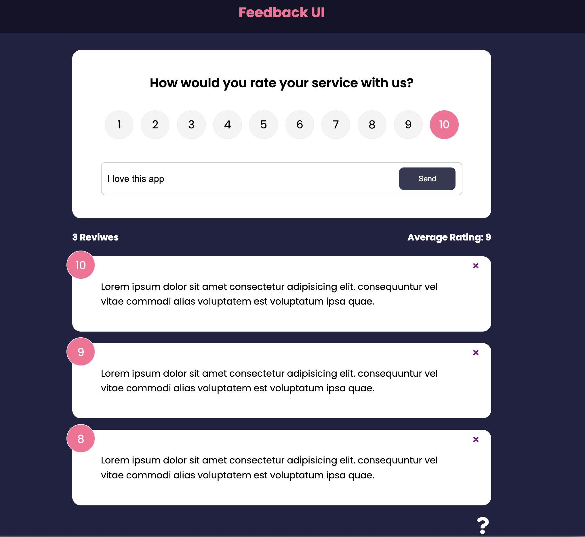

# React Feedback App

## It allows users to add, update and delete feedback. It uses a mock REST api with json-server

#### [Demo](https://beamish-phoenix-682975.netlify.app/)

### This project goes over all of the fundamentals of React including

- Components
- JSX
- Props (proptypes, defaultprops, etc)
- State (Component & App Level)
- Styling
- Handling Events
- Lists & Keys
- Forms
- Context API
- HTTP Requests
